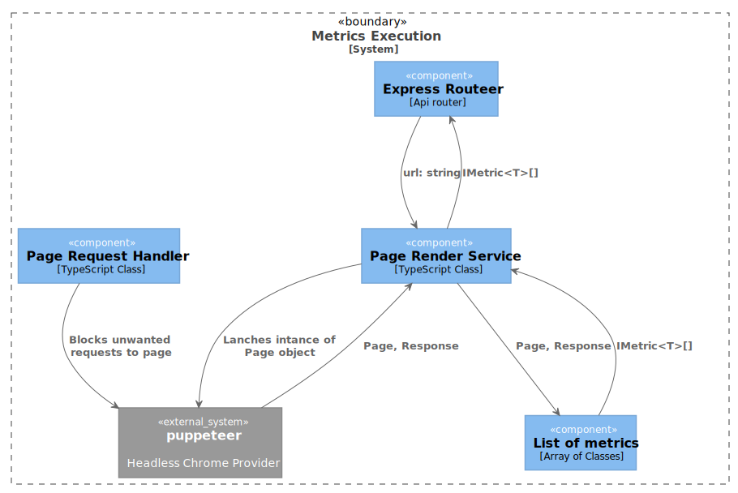

# Top 10 things developers need to know about SEO

A Simple API containing a curated set of metrics about the health of a webpage from the technical SEO point of view. It should act as a starting point for an engineer who likes to play and learn more about extracting insights from web pages for the purposes of SEO or testing.

### Prerequisites

```
nodejs >=12
yarn > 1
```

### Installing

To install dependecies

```
yarn install
```

To build and run

```
yarn starts
```

## Using the API

- **URL**
  `/api/page-health`

- **Method:**

  - `GET`

- **URL Params**

  **Required:**

  - `url=[string]`

- **Response**

```
[
    {
        value: actuall value of this metric,
        type: string|number|object|boolean....
        name: {string} name of this metric,
        isArray: {boolean} if the value is a collection or not
    },
    ...
]
```

### List of metrics names

- `isResponsive`

```
  {
    value: true|false,
    type: "boolean",
    name: "isResponsive",
    isArray: false
  }
```

- `isNoIndex`

```
  {
    value: true|false,
    type: "boolean",
    name: "isNoIndex",
    isArray: false
  }
```

- `internalLinks`

```
  {
    value: array of [ILinkData],
    type: "object",
    name: "internalLinks",
    isArray: true
  }
```

ILinkData: https://github.com/deepcrawl/top10-seo-list-for-developer/blob/master/docs/interfaces/ilinkdata.md

- `performanceMetrics`

```
  {
    value: array of [Paint PerformanceEntry],
    type: "object",
    name: "internalLinks",
    isArray: true
  }
```

PerformanceEntry: https://developer.mozilla.org/en-US/docs/Web/API/PerformanceEntry

- `tfIdfScore`

```
  {
    value: array of 10 most important tfIdf terms,
    type: "object",
    name: "internalLinks",
    isArray: true
  }
```

tfIdfTerm: https://github.com/NaturalNode/natural#tf-idf

```
term: string;
tf: number;
idf: number;
tfidf: number;
```

- `responseStatus`

```
  {
    value: 200,
    type: "number",
    name: "responseStatus",
    isArray: false
  }
```

- `schemaOrg`

```
  {
    value: array of IMiccroDataScope
    type: "object",
    name: "schemaOrg",
    isArray: true
  }
```

IMiccroDataScope: https://github.com/deepcrawl/top10-seo-list-for-developer/blob/master/docs/interfaces/imiccrodatascope.md

- `redirectChain`

```
  {
    value: array of IRedirectChainItem
    type: "object",
    name: "redirectChain",
    isArray: true
  }
```

IRedirectChainItem: https://github.com/deepcrawl/top10-seo-list-for-developer/blob/master/docs/interfaces/iredirectchainitem.md

- `allowedInRobotsTxt`

```
  {
    value: IAllowedInRobotsTxt
    type: "object",
    name: "allowedInRobotsTxt",
    isArray: false
  }
```

IAllowedInRobotsTxt: https://github.com/deepcrawl/top10-seo-list-for-developer/blob/master/docs/interfaces/iallowedinrobotstxt.md

## Code Documentation

If you like to read how each metric is calculated please refer to the [code documentation.](https://github.com/deepcrawl/top10-seo-list-for-developer/blob/master/docs/README.md)

### High level API



### Metric exampel: Internal links


## Built With ❤️ using

- [TypeScript](https://www.typescriptlang.org/) - JavaScript that scales
- [Puppeteer](https://github.com/GoogleChrome/puppeteer) - Headless Chrome Node.js API
- [cheerio](https://github.com/cheeriojs/cheerio) - jQuery designed specifically for the server

## License

This project is licensed under the MIT License - see the [LICENSE.md](LICENSE.md) file for details

## Acknowledgments

- [Rachel Costello](https://twitter.com/rachellcostello) - Technical SEO, Content Manager and Author @DeepCrawl
- [Alec Bertram](https://twitter.com/KiwiAlec) - Reformed SEO and born-again product person
