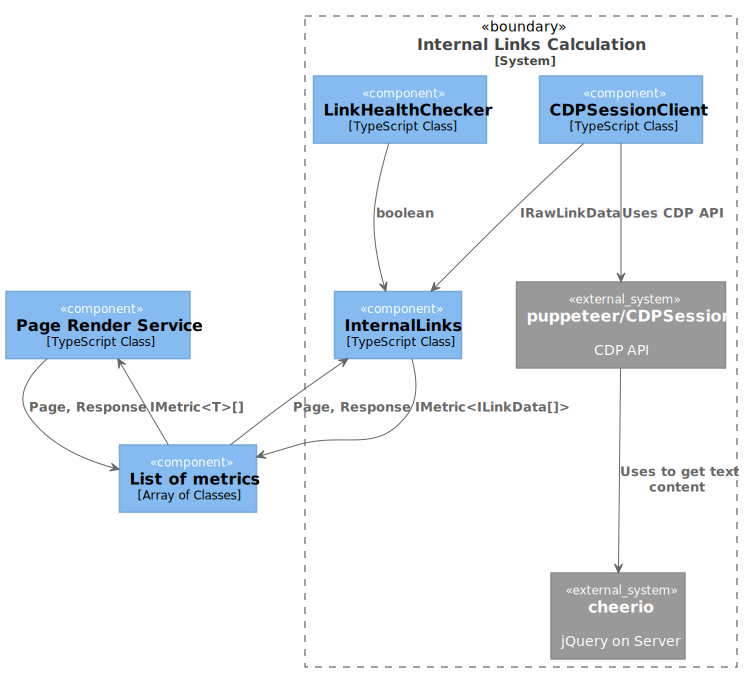

# Top 10 things developers need to know about SEO

A Simple API containing a curated set of metrics about the health of a webpage from the technical SEO point of view. It should act as a starting point for an engineer who likes to play and learn more about extracting insights from web pages for the purposes of SEO or testing.

### Prerequisites

```
nodejs >=12
yarn > 1
```

### Installing

To install dependecies

```
yarn install
```

To build and run

```
yarn starts
```

## Using the API

- **URL**
  `/api/page-health`

- **Method:**

  - `GET`

- **URL Params**

  **Required:**

  - `url=[string]`

- **Response**

The endpoints response will be an array of all the metrics below, each with a unique name and interface for the value property. If value property is an array, then the `isArray` property will be `true`.

`type` property is the name of the data type of the value property and when value is an array, then type name will be the name of the data type of it's items.

```
[{
    value: "any",
    type: "string|number|object|boolean"
    name: "string name of metric",
    isArray: true | false
  },
  ...
]
```

### List of metrics

<details>
<summary>isResponsive</summary>
<p>

```
{
  "value": true | false,
  "type": "boolean",
  "name": "isResponsive",
  "isArray": false
}
```

</p>
</details>

<details>
<summary>isNoIndex</summary>
<p>

```
{
  "value": true | false,
  "type": "boolean",
  "name": "isNoIndex",
  "isArray": false
}
```

</p>
</details>

<details>
<summary>internalLinks</summary>
<p>

```
{
  value: [{
    href: "https://stackoverflow.com",
    listeners: [{
      type: "click",
      useCapture: false,
      passive: false,
      once: false,
      scriptId: "12",
      lineNumber: 2,
      columnNumber: 9085
    }],
    text: " Stack Overflow ",
    healthy: true
  }],
  type: "object",
  name: "internalLinks",
  isArray: true
}
```

ILinkData: https://github.com/deepcrawl/top10-seo-list-for-developer/blob/master/docs/interfaces/ilinkdata.md

</p>
</details>

<details>
<summary>performanceMetrics</summary>
<p>

```
{
  value: [{
      name: "first-paint",
      entryType: "paint",
      startTime: 1171.500000054948,
      duration: 0
    },
    {
      name: "first-contentful-paint",
      entryType: "paint",
      startTime: 1171.500000054948,
      duration: 0
    }
  ],
  type: "object",
  name: "internalLinks",
  isArray: true
}
```

PerformanceEntry: https://developer.mozilla.org/en-US/docs/Web/API/PerformanceEntry

</p>
</details>

<details>
<summary>tfIdfScore</summary>
<p>

```
{
  value: [{
      term: "http",
      tf: 22,
      idf: 0.3068528194400547,
      tfidf: 6.750762027681204
    },
    {
      term: "request",
      tf: 22,
      idf: 0.3068528194400547,
      tfidf: 6.750762027681204
    },
    {
      term: "status",
      tf: 19,
      idf: 0.3068528194400547,
      tfidf: 5.830203569361039
    }
  ],
  type: "object",
  name: "internalLinks",
  isArray: true
}
```

tfIdfTerm: https://github.com/NaturalNode/natural#tf-idf

</p>
</details>

<details>
<summary>responseStatus</summary>
<p>

```
{
  "value": 200,
  "type": "number",
  "name": "responseStatus",
  "isArray": false
}
```

</p>
</details>

<details>
<summary>schemaOrg</summary>
<p>

```
{
  value: [{
    @type: "Answer",
    upvoteCount: "200",
    text: " I recommend status code 422, "
    Unprocessable Entity ". 11.2. 422 Unprocessable Entity The 422 (Unprocessable Entity) status code means the server understands the content type of the request entity (hence a 415(Unsupported Media Type) status code is inappropriate), and the syntax of the request entity is correct (thus a 400 (Bad Request) status code is inappropriate) but was unable to process the contained instructions. For example, this error condition may occur if an XML request body contains well-formed (i.e., syntactically correct), but semantically erroneous, XML instructions. ",
    dateCreated: "",
    url: "/a/3291292"
  }]
  type: "object",
  name: "schemaOrg",
  isArray: true
}
```

IMiccroDataScope: https://github.com/deepcrawl/top10-seo-list-for-developer/blob/master/docs/interfaces/imiccrodatascope.md

</p>
</details>

<details>
<summary>redirectChain</summary>
<p>

```
{
  value: [{
    url: "https://stackoverflow.com/questions/3290182/rest-http-status-codes-for-failed-validation-or-invalid-duplicate",
    status: 200,
    isRedirect: false
  }]
  type: "object",
  name: "redirectChain",
  isArray: true
}
```

IRedirectChainItem: https://github.com/deepcrawl/top10-seo-list-for-developer/blob/master/docs/interfaces/iredirectchainitem.md

</p>
</details>

<details>
<summary>allowedInRobotsTxt</summary>
<p>

```
  {
    value: {
      isAllowed: true,
      matchedAtLine: 68
    },
    type: "object",
    name: "allowedInRobotsTxt",
    isArray: false
  }
```

IAllowedInRobotsTxt: https://github.com/deepcrawl/top10-seo-list-for-developer/blob/master/docs/interfaces/iallowedinrobotstxt.md

</p>
</details>

## Code Documentation

If you like to read how each metric is calculated please refer to the [code documentation.](https://github.com/deepcrawl/top10-seo-list-for-developer/blob/master/docs/README.md)

### High level API


### Metric example: Internal links



## Built With ❤️ using

- [TypeScript](https://www.typescriptlang.org/) - JavaScript that scales
- [Puppeteer](https://github.com/GoogleChrome/puppeteer) - Headless Chrome Node.js API
- [cheerio](https://github.com/cheeriojs/cheerio) - jQuery designed specifically for the server

## License

This project is licensed under the MIT License - see the [LICENSE.md](LICENSE.md) file for details

## Acknowledgments

- [Rachel Costello](https://twitter.com/rachellcostello) - Technical SEO, Content Manager and Author @DeepCrawl
- [Alec Bertram](https://twitter.com/KiwiAlec) - Reformed SEO and born-again product person
